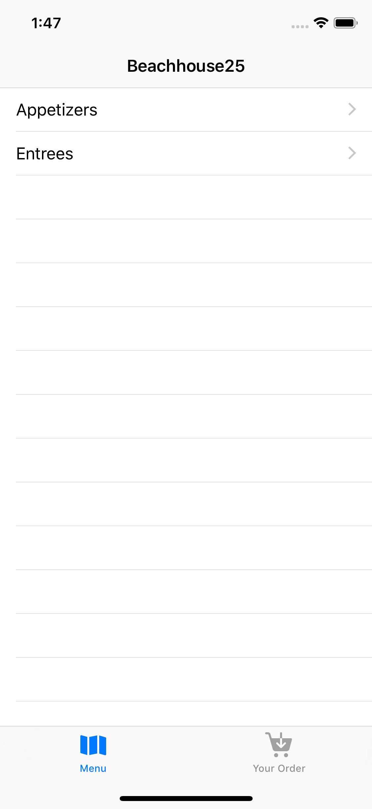
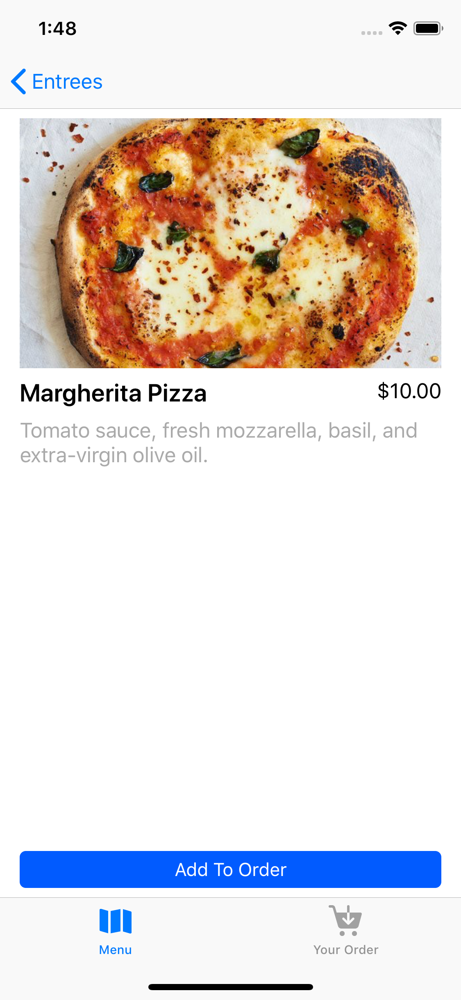
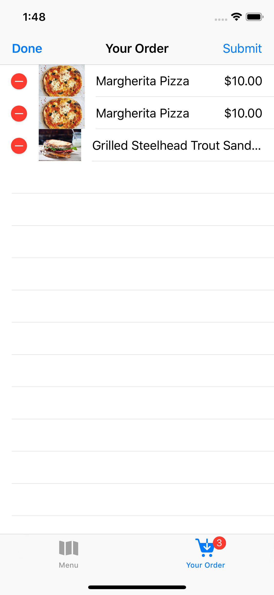
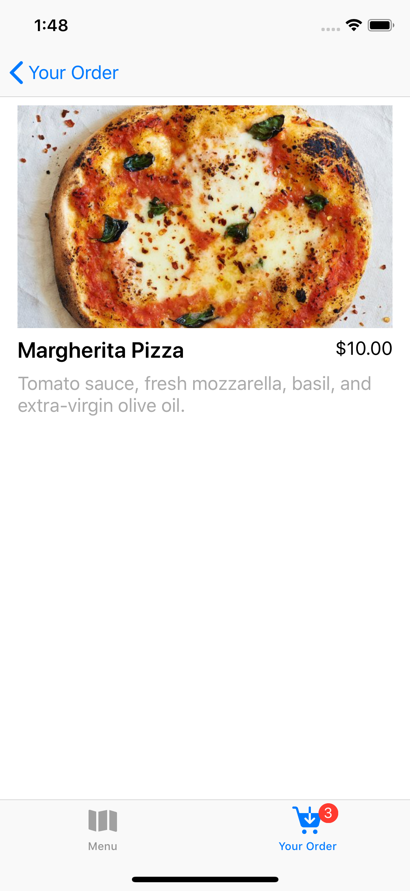
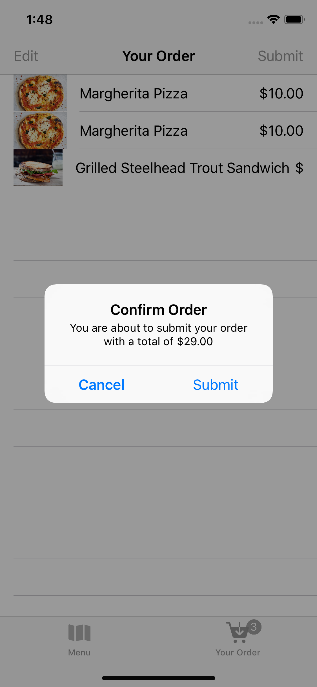

# Restaurant
## Initial Features
### -Retrieve data from internet
### -Choose a category
### -See a detailed view of a dish
### -Add the dish to your order
### -See your order
### -Edit your order
### -Submit your order

## Updated Features
### -Added State Restoration
####        Archive the state so IOS initiates that state next time it's launched
### -Store the data from the internet on the device and update it only when the app is launched
### -Added the function to see a detailed view of a dish from the order without the option to add it again to the order
### -Added the function to enlarge the image to full screen when in detailed view

### Home Screen
<kbd></kbd>

### Entrees
<kbd></kbd>

### Detailed view from menu
<kbd></kbd>

### Full screen image
<kbd></kbd>

### Order
<kbd></kbd>

### Detailed view from order
<kbd></kbd>

### Confirm your order
<kbd></kbd>

### Dismiss the message
<kbd></kbd>
